# 操作ガイド — Pathways viewer for *Saccharomyces cerevisiae*

出芽酵母の遺伝子どうしの制御関係（リン酸化・転写制御・結合など）を地図にして、
「ある遺伝子の上流・下流に何があるか」「2 つの遺伝子がどんな経路でつながるか」を調べるアプリです。
この文書では、初めて使う人に向けて、**地図（マップ）の操作**と**左側のタブの使い方**を順に説明します。

細かい決まり（並べ方・階層の決め方など）はアプリの中の「Help」ボタンと [README](../README.md) にまとめてあります。

画面の写しのうち、1 章・6 章（登録を除く）・7 章のものは今の版です。ほかは前の版のもので、地図の上の選択肢（「色」「条件」など）や左のタブの名前（「TFs」など）が今と違うことがありますが、操作は同じです。

---

## 目次

1. [画面の見取り図](#1-画面の見取り図)
2. [遺伝子を地図に出す（検索と注目）](#2-遺伝子を地図に出す検索と注目)
3. [地図の読み方](#3-地図の読み方)
4. [地図の操作（選択・拡張・線）](#4-地図の操作選択拡張線)
5. [表示枠のボタンと設定](#5-表示枠のボタンと設定)
6. [左側のタブ](#6-左側のタブ)
   - [遺伝子](#6-1-遺伝子--地図の遺伝子を一覧で選ぶ)
   - [TF](#6-2-tf--転写因子を地図に加える)
   - [経路](#6-3-経路--遺伝子どうしのつながりを調べる)
   - [条件](#6-4-条件--どんな条件で報告された関係か)
   - [破壊株](#6-5-破壊株--壊した株での実測を見る)
   - [登録](#6-6-登録--よく見る地図を保存する)
7. [条件ごとの発現・リン酸化を見る](#7-条件ごとの発現リン酸化を見る)
8. [データベース・情報源タブ](#8-データベース情報源タブ)
9. [使い方の例](#9-使い方の例)
10. [困ったとき](#10-困ったとき)

---

## 1. 画面の見取り図

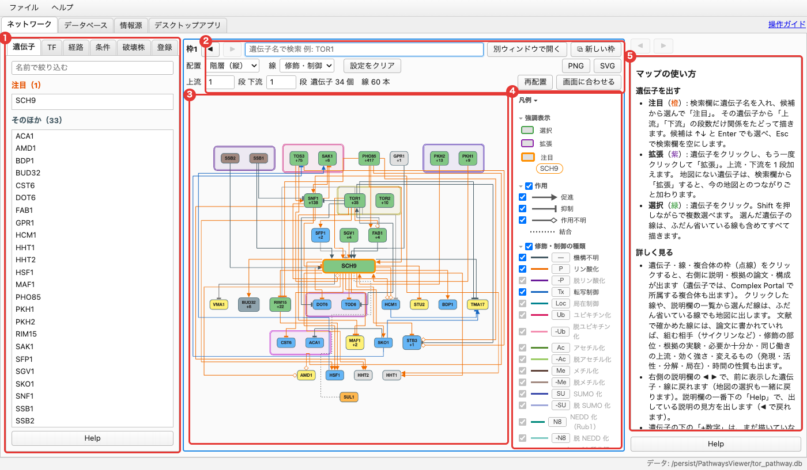

ネットワークタブの画面は、次の 5 つに分かれています（番号は画像の赤い丸）。

| 番号 | 場所 | 役割 |
|---|---|---|
| 1 | **左側のタブ**（遺伝子・TF・経路・条件・破壊株・登録） | 地図の遺伝子を一覧で選ぶ、転写因子を加える、経路を調べる、条件で目立たせる、破壊株の実測で色分けするなど |
| 2 | **検索欄**（表示枠の上） | 遺伝子を探して地図に出す。下の 2 行は配置・線の色・段数などの設定 |
| 3 | **地図** | 遺伝子（箱）と関係（線） |
| 4 | **凡例**（地図の右端） | 色・線・記号の意味。チェックを外すと、その種類を地図から隠す |
| 5 | **説明欄**（一番右） | クリックした遺伝子・線・枠の説明、根拠の論文 |

起動すると TOR1 に注目した地図が出ます。画面の上のタブで「データベース」「情報源」に切り替えられます（[8 章](#8-データベース情報源タブ)）。

どの欄にも一番下に **Help** ボタンがあり、その欄の使い方を説明欄に出します。

---

## 2. 遺伝子を地図に出す（検索と注目）

地図は全遺伝子を一度に描かず、**注目した遺伝子の周りだけ**を描きます。

1. 表示枠の上の検索欄（①）に遺伝子名を入れます（例: `SCH9`）。Systematic 名でも探せます。
2. 候補の一覧から選ぶか Enter を押すと、「**拡張**」「**注目**」の吹き出し（②）が出ます。
3. 「**注目**」を押すと、その遺伝子を中心に地図を描き直します。

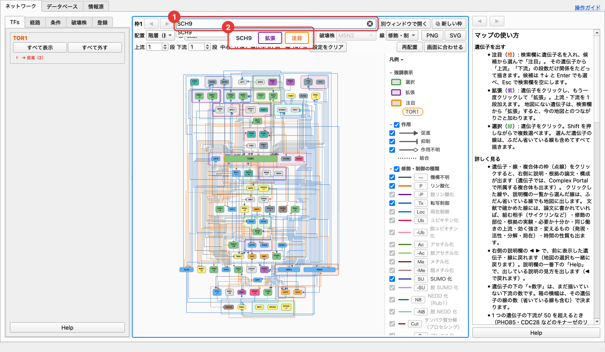

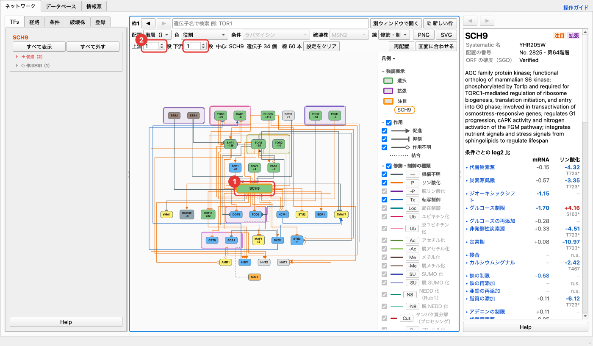

- 注目している遺伝子（①）は**橙の太い枠**で示します。注目は常に 1 つです。
- 検索欄の下の「**上流 ○ 段 下流 ○ 段**」（②）で、注目した遺伝子から何段までたどって描くかを決めます（既定は 1 段ずつ）。段数を増やすと遺伝子が一気に増えるので、1〜2 段から始めるのがおすすめです。
- 同じ行の「遺伝子 ○ 個 線 ○ 本」が、今描いている数です。
- 検索欄で ↑↓ と Enter でも候補を選べます。Esc で検索欄を空にします。

---

## 3. 地図の読み方

### 遺伝子（箱）

- **箱の色**は役割です（キナーゼ・ホスファターゼ・転写制御因子など。SGD の機能説明から推定した目安）。色の意味は凡例の「役割」欄にあります。左の「破壊株」タブで株を選んでいる間だけ、その株での実測の色になります（[6-5](#6-5-破壊株--壊した株での実測を見る)）。
- **「+数字」**は、まだ地図に描いていない下流の数です。
- **箱の横幅**は、その遺伝子が持つ関係の数（地図で省いている関係も含む）で決まります。幅の広い箱はハブです。
- 地図は**上流ほど上の段**に並びます（配置「階層（縦）」のとき）。

### 線（関係）

- **線の終わりの印**が作用です: 三角＝促進、T 字＝抑制、白抜きの菱形＝作用不明、点線＝向きのない結合。
- **線の色**は修飾・制御の種類です（橙＝リン酸化、紫＝脱リン酸化、青＝転写制御 など）。色を「作用」に切り替えると、赤＝促進・青＝抑制・灰＝作用不明で塗ります（[5 章](#5-表示枠のボタンと設定)）。
- 作用不明の関係は、促進・抑制どちらにもなりうる関係として扱っています。

### 枠

地図の遺伝子は、3 種類の枠で囲まれることがあります。

| 枠 | 意味 |
|---|---|
| **点線の枠** | 複合体（Complex Portal）。構成要素が 2 つ以上地図にあるとき囲みます（例: TOR1・TOR2） |
| **二重線の枠** | パラログ（全ゲノム重複などでできた、役割が重なりうる組。例: SSB1/SSB2、PKH1/PKH2）。片方が地図にあれば、もう片方も加えて隣に並べます |
| **実線の大きな枠**（地図の下） | 「○○ の下流 リン酸化 286」のような、下流のまとめ。下流が 50 を超える遺伝子（PHO85・CDC28・TPK1 など）の標的は、線で描かずにここに並べます |

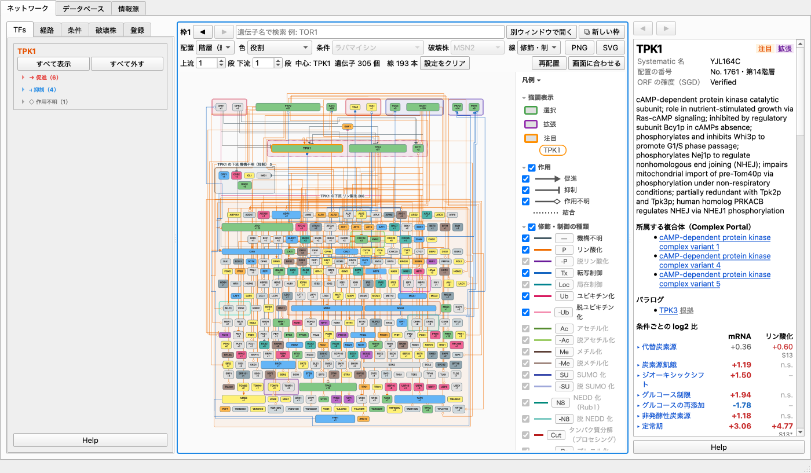

- 枠の名前は、枠を押したときと、中の遺伝子を選んだときだけ出ます（下流のまとめの名前はいつも出ます）。
- 複合体の中の遺伝子どうしの線や、下流のまとめへの線はふだん隠しています。**枠を押すと出ます**（もう一度押すと隠れます）。
- 論文が相手を複合体の名前（TORC1・PKA など）でしか書いていない関係は、枠から 1 本の線で描きます。

---

## 4. 地図の操作（選択・拡張・線）

### 遺伝子をクリックする（選択・緑）

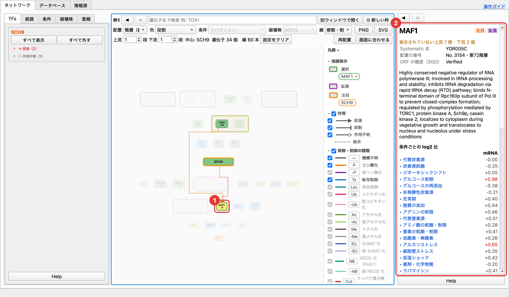

- 遺伝子を 1 回クリックすると**選択**（緑）になり、右の説明欄にその遺伝子の説明が出ます。
- 選んだ遺伝子とつながる遺伝子・線だけが濃く残り、ほかは薄くなります。ふだん省いている線も、選んだ遺伝子の分はすべて描きます。
- **Shift を押しながら**クリックすると、複数選べます。
- **背景をクリック**すると、選択と強調が外れます。
- 左の「遺伝子」タブの一覧からも選べます（[6-1](#6-1-遺伝子--地図の遺伝子を一覧で選ぶ)）。

説明欄には、Systematic 名・SGD の機能説明・条件ごとの発現とリン酸化の変化（log2 比）・上流と下流の一覧などが出ます。説明欄の一番下の Help で、各項目の見方を出せます。

### もう一度クリックする（拡張・注目）

選択中の遺伝子をもう一度クリックすると、遺伝子の下に「拡張」「注目」（①）が出ます。

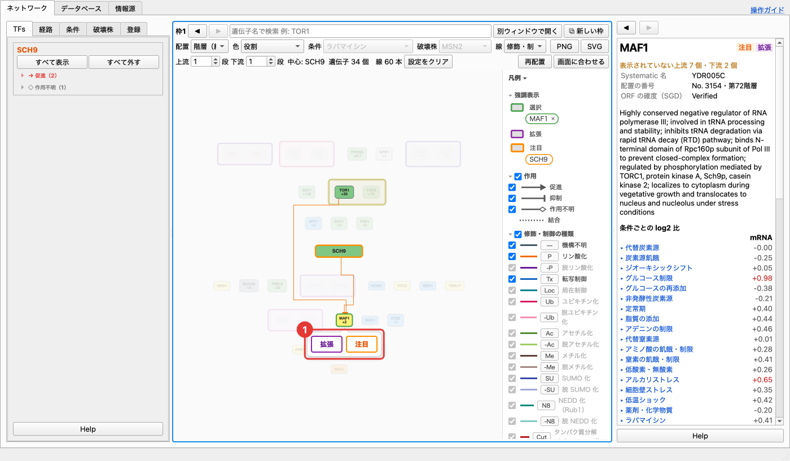

- **注目**（橙）: その遺伝子を中心に地図を描き直します。
- **拡張**（紫）: 今の地図はそのままで、その遺伝子の直接の上流・下流を 1 段加えます。

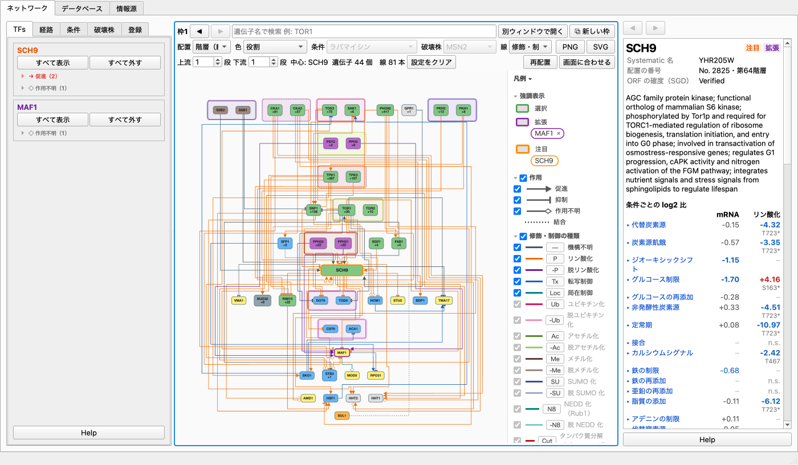

- 拡張した遺伝子は紫の枠で示し、凡例の「強調表示」（②）に名前が並びます。名前の横の × で、その拡張で加えた遺伝子をまとめて外せます。
- 地図にない遺伝子でも、検索欄から「拡張」を選ぶと、今の地図とのつながり（3 段以内の経路）ごと加わります。

### 線をクリックする

線をクリックすると、説明欄にその関係の詳細が出ます。

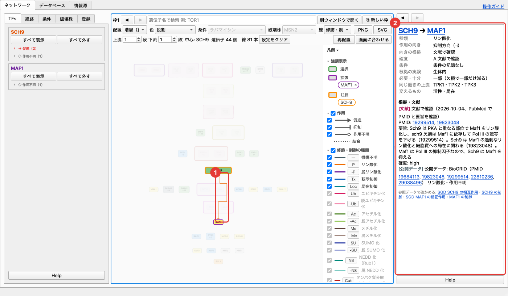

- **種類**（リン酸化など）、**作用の向き**（促進・抑制）、**向きの根拠**、**確度**（A 文献で確認 〜 D 推定だけ）
- **条件**（その関係が報告された条件）
- **根拠・文献**: 出典ごとに 1 行。PMID を押すと PubMed を開きます。
- 文献で確かめた関係では、修飾の部位・根拠の実験（生体内・試験管内など）・同じ働きの上流なども出ます。

### 戻る・進む

- 表示枠の左上の **◀ ▶** で、前の地図に戻る・進むことができます（注目・拡張・段数・TF・凡例と条件タブのチェックも戻ります）。
- 説明欄の上の **◀ ▶** で、前に表示した説明に戻れます。

### 地図を動かす

- 背景をドラッグすると表示範囲が動き、ホイール（またはピンチ）で拡大・縮小します。
- 遺伝子はドラッグで動かせません（配置は自動で決めます）。
- 縮小すると、下流の枝先を自動で省いて見やすくします（凡例の「表示」欄で切り替え）。

---

## 5. 表示枠のボタンと設定

表示枠の上の 3 行には、次のボタンと選択肢があります。

**1 行目**

| ボタン | 働き |
|---|---|
| ◀ ▶ | 前の地図に戻る・進む |
| 検索欄 | 遺伝子を探して注目・拡張する（[2 章](#2-遺伝子を地図に出す検索と注目)） |
| 別ウィンドウで開く | この表示枠を別の窓に出す |
| ⧉ 新しい枠 | 表示枠を増やす（最大 4 つ）。緑で選んでいる遺伝子に注目して開きます |

**2 行目**（全部の表示枠に共通の設定）

| 選択肢 | 中身 |
|---|---|
| 配置 | 階層（縦）・階層（横）・同心円・格子 |
| 線 | 線の色。修飾・制御（種類で色分け）か、作用（赤＝促進・青＝抑制） |
| 設定をクリア | TF・経路・条件・配置・遺伝子の色・線・凡例を最初の状態に戻す（注目・拡張・段数はそのまま） |
| PNG・SVG | この表示枠の図全体を画像で保存（画面に見えていない部分も含む） |

**3 行目**

| ボタン | 働き |
|---|---|
| 上流・下流の段数 | 注目した遺伝子から何段たどるか |
| 再配置 | 今の注目・拡張・段数から地図を描き直す |
| 画面に合わせる | 図全体が収まるように表示する（緑で選んでいれば、その選択と線の表示はそのまま） |

遺伝子の色は、ここではなく左のタブで変えます（破壊株タブで株を選ぶと、その株の実測の色。選択をやめると役割の色に戻ります）。

### 表示枠を増やす

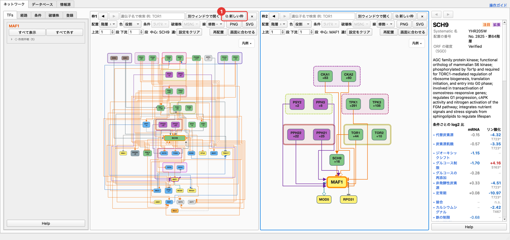

「⧉ 新しい枠」で表示枠を 4 つまで並べ、別々の遺伝子に注目できます。**青い枠が操作中の表示枠**で、左側のタブは操作中の枠に効きます。

### 凡例で隠す

凡例の各行のチェックを外すと、その種類を地図から隠します（全部の表示枠に共通）。

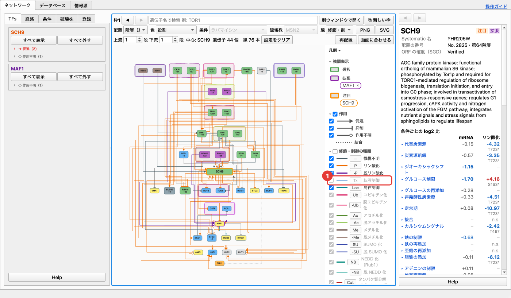

- **作用**: 促進・抑制・作用不明の線
- **修飾・制御の種類**: リン酸化・転写制御・結合などの線
- **役割**: その役割の遺伝子
- 見出しの左のチェックで、欄の項目をまとめて切り替えます。
- 隠しても配置は詰めません。「再配置」を押すと、見えているものだけで並べ直します。

---

## 6. 左側のタブ

左側のタブは、どれも**操作中の表示枠**（青い枠）に効きます。

### 6-1. 遺伝子 — 地図の遺伝子を一覧で選ぶ

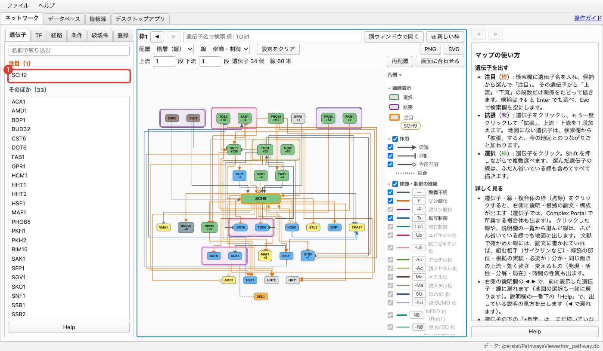

今の地図にある遺伝子が、「**注目**」（橙）・「**拡張**」（紫）・「**そのほか**」の見出しで分けて、それぞれ名前の順に並びます（括弧の中は数）。上の欄に名前を入れると絞り込めます。

- 遺伝子を押すと、地図でその遺伝子を緑で選択し、右側に説明を出します。地図で緑に選んだ遺伝子は、一覧でも選ばれます。
- 緑で選んでいる遺伝子を**もう一度押す**と、地図がその遺伝子へ移って拡大します（凡例の名前を押したときと同じ）。
- ⌘（Windows は Ctrl）を押しながら押すと 1 つずつ、Shift を押しながら押すと範囲で、複数を選べます。

### 6-2. TF — 転写因子を地図に加える

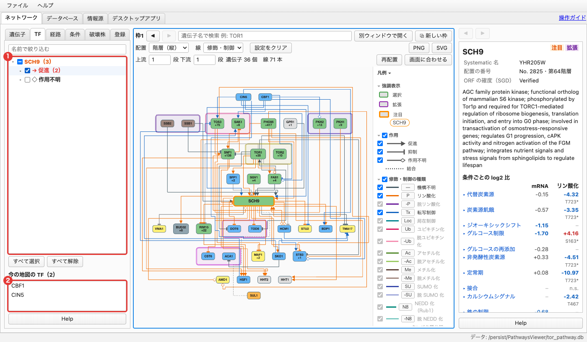

注目・拡張している遺伝子の**転写を制御する転写因子**の一覧です。転写制御は地図の上下の並びに使わないので、転写因子はふだん地図に出ていません。ここでチェックしたものだけを、地図の**一番上の段**に出します。

- 一番上の「**名前で絞り込む**」に名前を入れると、名前に含む転写因子に絞ります（遺伝子の名前に含むなら、その遺伝子の転写因子をすべて残します）。
- 一覧は 遺伝子 → 作用（→ 促進・⊣ 抑制・◇ 作用不明）→ 転写因子 の順です（条件タブと同じ形）。遺伝子の題名の色で注目（橙）と拡張（紫）を区別します。▸ で開閉し、（ ）の中は数です。
- 遺伝子・作用のチェックで、中の転写因子をまとめて切り替えます。一覧の下の「**すべて選択**」「**すべて解除**」は、一覧の転写因子すべてです。
- 転写因子は名前の順です。**灰色**は、ほかの関係ですでに地図にあるもので、群の最後に並びます。
- ⇄ は複数の遺伝子に並ぶ転写因子です（チェックは連動します）。
- 転写因子の名前を押すと、右側に説明を出します。
- 「**今の地図の TF**」は、いま地図に出している転写因子の一覧です（名前の順）。押すと右側に説明を出します。

### 6-3. 経路 — 遺伝子どうしのつながりを調べる

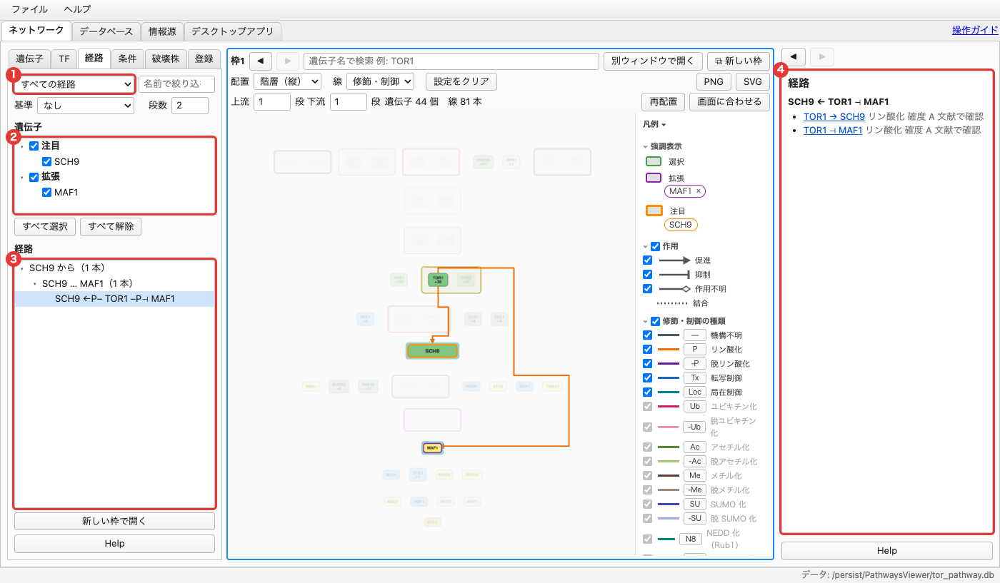

選んだ遺伝子どうしが**どんな経路でつながっているか**を一覧にします。

**1. 表示経路を選ぶ**

- 左上の選択欄で、どんな経路を出すかを選びます。

| 表示経路 | 出すもの |
|---|---|
| なし | 経路を出さない（普段の地図） |
| すべての経路 | チェックした遺伝子どうしを結ぶ経路（矢印の向きは問わない。A → X ← B のような共通の標的を経由するものも含む） |
| 矢印の向きにたどれる経路 | チェックした遺伝子から、別のチェックした遺伝子へ矢印の向きにたどれる経路 |
| すべてを制御している遺伝子 | チェックした遺伝子すべての上流にある、共通の制御因子とそこからの経路 |
| すべてから制御を受けている遺伝子 | チェックした遺伝子すべての下流にある、共通の標的とそこへの経路 |
| 基準の遺伝子へ／から作用している経路 | 基準の遺伝子へ（から）矢印の向きにたどれる経路（基準を選ぶ） |

- 右上の「**名前で絞り込む**」に文字を入れると、遺伝子の一覧と経路の一覧（その名前の遺伝子を通る経路）を絞り込みます。

**2. 基準と段数**

- **基準**: チェックした遺伝子から選ぶと、その遺伝子が端にある経路だけにします。
- **段数**（1〜3）: **ちょうど**その段数の経路だけを出します。1 なら直接の関係です。複合体は 1 つとして数えます。

**3. 遺伝子を選ぶ**

- 「遺伝子」の一覧には、注目・拡張している遺伝子が群（注目・拡張）ごとに名前の順で並びます。調べたいものにチェックします（群のチェックでまとめて切り替え。「すべて選択」「すべて解除」も使えます）。
- 一覧が空なら、地図で遺伝子に注目するか拡張すると加わります。

**4. 経路を見る**

- 「経路」の一覧は「SCH9 から」→「SCH9 … MAF1」（行き先の名前の順）→ 経路 1 本ずつ、の 3 段です。各段の数は中の経路の本数です。
  記号: → 促進、⊣ 抑制、◇ 作用不明、← ⊢ は右から左への矢印、P・Tx などは関係の種類です。長い経路は途中で省くので、カーソルを重ねると全体が出ます。
- 共通の制御因子・標的があれば、一覧の下に数と名前が並びます（多いときは初めの 30 個。すべては一覧の「X から」に並びます）。
- 一覧で経路を選ぶと、その経路を地図に描いて強調します（上の段を選ぶと、中の経路をすべて）。経路の途中の遺伝子が地図になければ、一時的に加えます。選んでいる経路をもう一度押すと選択が外れます。
- 右側の説明欄には、選んだ経路ごとに、段ごとの関係（線・種類・確度）が並びます。線の名前を押すと、その関係の説明（根拠の論文など）に移ります。選択を外すと、経路タブの使い方に戻ります。
- 地図の遺伝子をクリックすると、その遺伝子を通る経路を上に並べ、通らない組は灰色にして下に回します。背景をクリックすると戻ります。
- 経路が多すぎて一覧を打ち切ったと出たら、段数を減らすか、チェックする遺伝子を絞ってください。
- 「**新しい枠で開く**」で、描いている経路の遺伝子だけを新しい表示枠に出せます。
- 表示経路を「なし」にすると、普段の地図に戻ります。
- 経路は転写制御もたどります。凡例で隠した種類の関係はたどりません。

### 6-4. 条件 — どんな条件で報告された関係か

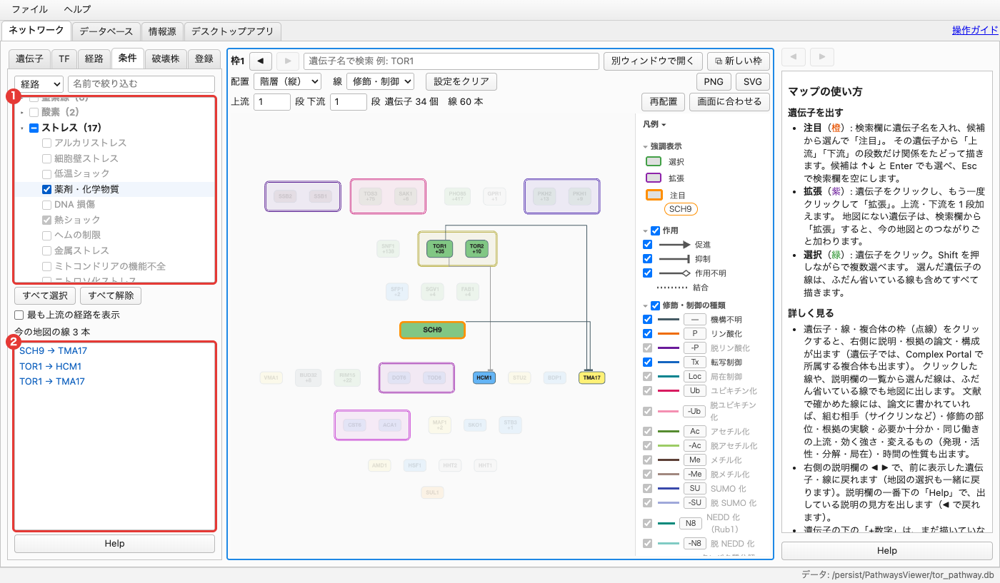

左上の選択肢で、見るものを「**経路**」と「**遺伝子**」で切り替えます。どちらも、上に条件の一覧（群で開閉。灰色の条件はチェックも薄く出ます）、中ほどに「すべて選択」「すべて解除」などの見方、下に今の地図のもの、の同じ形です。右の欄に名前を入れると条件を絞り込めます。遺伝子は [7 章](#7-条件ごとの発現リン酸化を見る) を見てください。以下は経路です。

関係（線）が**どんな条件で報告されたか**（ストレス・栄養・細胞周期の時期など）で、地図を絞ります。条件の分け方は YEASTRACT+ の環境条件に合わせ、細胞周期の時期（G1・S・G2・分裂期など）を加えています。

- チェックした条件の線と、その両端の遺伝子だけを目立たせます。ほかの線は消し、ほかの遺伝子は薄くします。すべてチェックしていれば普段の地図です。
- 群（ストレス・炭素源・細胞周期など）は ▸ で開き、群のチェックで中の条件をまとめて切り替えます。
- 一覧の下の「**すべて選択**」「**すべて解除**」で、条件をまとめて切り替えます。よく使うのは「すべて解除」してから見たい条件だけにチェックする方法です。
- **今の地図に線がない条件は灰色**で表示します。黒い条件を選ぶと地図に変化が出ます。
- 「**最も上流の経路を表示**」: チェックした条件の線のうち、経路の起点になる線とその両端だけを目立たせます。
- 「条件の記録なし」は、条件がまだ分かっていない関係です。
- 一番下の欄に、チェックした条件に合う今の地図の線が名前の順に並びます。押すと右側に線の説明が出ます。
- 条件は「その条件で報告がある」という意味で、その条件のときだけ働くとは限りません。

### 6-5. 破壊株 — 壊した株での実測を見る

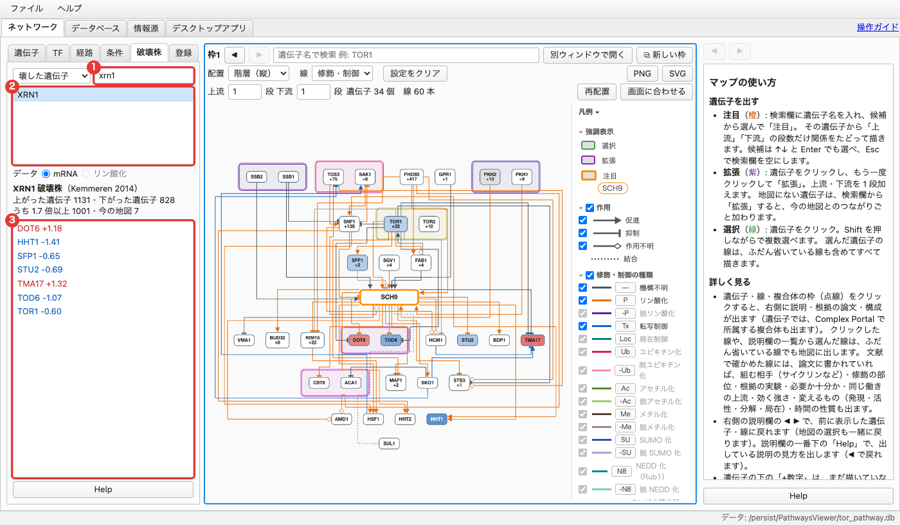

遺伝子を 1 つ壊した株で、ほかの遺伝子の mRNA やリン酸化が**実際にどう変わったか**（野生型との比の実測）を地図で見ます。

- **探し方**（左上の選択肢）:
  - **壊した遺伝子**: 破壊株が名前の順に並び、右の欄に名前を入れると、その名前を含む株に絞り込みます。株を押すと、地図をその株の実測で色分けし、下の欄にその株で変わった、**今の地図の遺伝子**が名前の順に出ます（見出しに、全体の数と今の地図の数）。
  - **変化した遺伝子**: 今の地図の遺伝子が名前の順に並び（右の欄で絞り込めます）、遺伝子を押すと右側にその説明が出て、下の欄にその遺伝子を変化させた破壊株が名前の順に並びます。株を押すと地図をその株で色分けし、右側に壊した遺伝子の説明が出ます。その遺伝子の上流にある遺伝子の候補を、実測から探せます。
- 株の一覧では、今の地図の遺伝子が変わった株を黒、1 つも変わっていない株を灰色で表示します。
- **データ**: mRNA（Deleteome、Kemmeren et al. 2014、1,481 株）と、リン酸化（Bodenmiller et al. 2010、キナーゼ・ホスファターゼの 113 株）を切り替えます。
- 地図の色: 赤＝増えた、青＝減った、黒＝壊した遺伝子。色分けしている株をもう一度押す、絞り込みで株が一覧から消える、「変化した遺伝子」に切り替える、のどれかで株の選択が外れると、役割の色に戻ります。
- 破壊の影響には間接のもの（X → Z → Y）も混ざります。Deleteome は富栄養の培地の測定なので、ストレスのときだけ働く遺伝子は、壊しても変わらないことがあります。

### 6-6. 登録 — よく見る地図を保存する

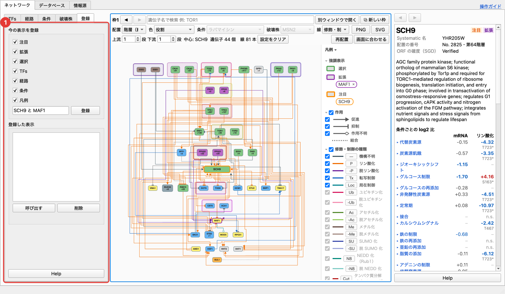

よく見る地図の状態に名前を付けて登録し、あとで呼び出します。

1. 「登録する項目」で、残したい項目にチェックします（注目・拡張・選択・TF・経路・条件・凡例。「すべて選択」「すべて解除」でまとめて切り替え）。
2. 名前を入れて「**登録**」を押します。
3. 「登録した表示」の一覧（名前の順）で選び、「**呼び出す**」（ダブルクリックでも可）で、登録した項目だけを操作中の表示枠に当てはめます。登録していない項目は今のままです（経路を含まない登録なら、今の経路の表示も保ちます）。

- 一覧で選ぶと、右側の説明欄に登録日と登録の中身が出ます。選んでいる登録をもう一度押すか、一覧の外をクリックすると選択が外れます。
- 同じ名前で登録すると上書きします。
- 登録はこの PC にだけ残ります。

---

## 7. 条件ごとの発現・リン酸化を見る

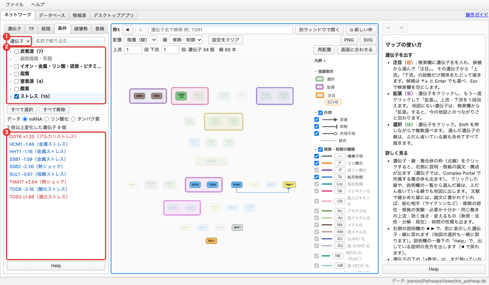

左の「**条件**」タブの左上を「**遺伝子**」に切り替え、「データ」で mRNA・リン酸化・タンパク質を選びます。チェックした条件（いくつでも。群のチェック・「すべて選択」「すべて解除」でまとめて切り替え）のどれかで **2 倍以上変化した遺伝子** だけを目立たせ、ほかは薄くします。すべてにチェックしていれば普段の地図です。地図の色は変えません。

- 下の欄に、目立たせた今の地図の遺伝子が名前の順に並びます。値はチェックした条件のうち変化の最も大きいもので、括弧の中がその条件です（赤＝増える、青＝減る）。押すと右側に説明が出ます。
- 値は対照（処理前・未処理）と比べた log2 の比です（+1 ＝ 2 倍、−1 ＝ 半分）。
- **発現（mRNA）**: SGD の発現データ（Gasch 2000・Causton 2001 など 93 の測定）。
- **リン酸化・タンパク質量**: Leutert et al. 2023（約 100 の条件に 5 分さらしたときの変化）。リン酸化は、その遺伝子のタンパク質がリン酸化されたかどうかで、キナーゼ自身の活性ではありません。
- 遺伝子をクリックすると、説明欄の「条件ごとの log2 比」に全部の条件の値が並びます。条件名を押すと、測定ごとの値と出典の論文が開きます。
- mRNA が変わらなくても、リン酸化や局在で働きが変わる遺伝子（TOR1・SCH9 などのキナーゼ）は多いので、発現とリン酸化は分けて見てください。

---

## 8. データベース・情報源タブ

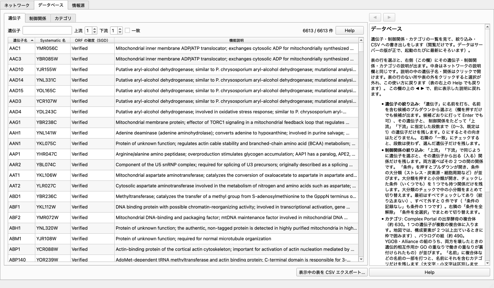

- **データベース**タブ: 遺伝子・制御関係・カテゴリ（複合体・パラログ）の一覧です。名前や上流・下流・条件で絞り込み（条件は「すべて解除」「すべて選択」でまとめて切り替え）、「表示中の表を CSV エクスポート…」で書き出せます（遺伝子・制御関係の表だけ。カテゴリのタブでは押せません）。行を選ぶと右に説明が出ます（中身はネットワークの説明欄と同じ。最初は空で、使い方は表の右上の Help）。閲覧専用です。
- **情報源**タブ: データの出典（SGD・BioGRID・YEASTRACT+ など）と、文献調査で使った論文の一覧（題名・著者で絞り込めます）、それぞれの利用条件です。

データはサーバーの版が正で、起動のたびに新しい版があれば自動で入れ替わります（「ファイル > 最新データを確認」で手動でも確かめられます）。

---

## 9. 使い方の例

### 例 1: SCH9 の上流と下流を見る

1. 検索欄に `SCH9` と入れ、「注目」。
2. 地図で上流（TORC1・PKH1/2 など）と下流（MAF1・RIM15・DOT6/TOD6 など）を見る。
3. 気になる線（例: SCH9 → MAF1）をクリックして、根拠の論文を説明欄で確かめる。

### 例 2: SCH9 と MAF1 がどうつながっているかを調べる

1. SCH9 に注目し、地図の MAF1 を 2 回クリックして「拡張」。
2. 左の「経路」タブで SCH9 と MAF1 にチェック。
3. 経路の段数を 2 にして、表示経路「すべての経路」を選ぶ。
4. 一覧の経路（例: SCH9 ← TOR1 ⊣ MAF1）を選ぶと、地図にその経路が描かれる。

### 例 3: ストレス条件で働く関係だけを見る

1. 左の「条件」タブ（左上は「経路」）で「すべて解除」。
2. 「ストレス」を ▸ で開き、黒く表示されている条件（例: 熱ショック）にチェック。
3. 下の欄の線や、地図に残った線をクリックして、説明欄の「条件」と根拠を確かめる。

### 例 4: ストレスで発現が大きく変わる遺伝子を見る

1. 左の「条件」タブの左上を「遺伝子」に切り替え、「データ」を mRNA にする。
2. 「すべて解除」してから、「ストレス」の群にチェック。
3. 目立った遺伝子と、下の欄の値（どの条件で何倍変わったか）を見る。遺伝子を押すと、説明欄に全部の条件の値が出る。

### 例 5: ある遺伝子を壊したとき、地図のどこが変わるかを見る

1. 左の「破壊株」タブで、壊した遺伝子の名前（例: `XRN1`）を入れて株を押す。
2. 地図が実測の変化（赤・青）で塗られ、下の欄に変わった今の地図の遺伝子が並ぶ。遺伝子を押すと説明が出る。
3. 終わったら、色分けしている株をもう一度押す（選択が外れ、役割の色に戻る）。

---

## 10. 困ったとき

| 困りごと | 対処 |
|---|---|
| 地図が込み入って読めない | 段数を 1 に減らす、凡例で関係の種類を絞る、「再配置」を押す、「画面に合わせる」で全体を見る |
| 線を描く前に確認が出た | 描く線が多いときの確認です。「キャンセル」で前の表示に戻ります |
| 元の状態に戻したい | ◀ で戻る。設定だけ戻すなら「設定をクリア」 |
| 地図が薄くなったまま戻らない | 背景をクリックする。条件タブで「すべて選択」（「経路」「遺伝子」それぞれ）、経路タブで表示経路を「なし」にする |
| 遺伝子の色が役割に戻らない | 破壊株タブで、色分けしている株をもう一度押す |
| 探している遺伝子が出ない | Systematic 名（例: YHR205W）でも探す。データベースタブで名前を検索する |
| 色分けが灰色ばかり | その株にデータがない遺伝子です。破壊株タブで、ほかの株を選んでみる |
| 条件タブ（遺伝子）で目立つ遺伝子がない | チェックした条件で 2 倍以上変わった遺伝子が今の地図にありません。条件を増やすか、「データ」を変えてみる |
| 使い方を確かめたい | 各欄の一番下の「Help」、またはメニューの「ヘルプ > 使い方」 |
